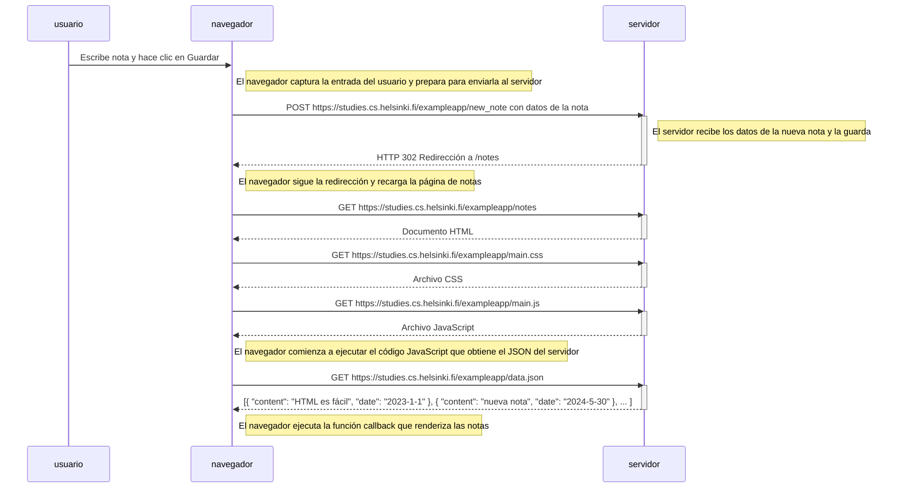

```mermaid

sequenceDiagram
    participant usuario
    participant navegador
    participant servidor

    usuario->>navegador: Escribe nota y hace clic en Guardar
    Note right of navegador: El navegador captura la entrada del usuario y prepara para enviarla al servidor

    navegador->>servidor: POST https://studies.cs.helsinki.fi/exampleapp/new_note con datos de la nota
    activate servidor
    Note right of servidor: El servidor recibe los datos de la nueva nota y la guarda
    servidor-->>navegador: HTTP 302 Redirección a /notes
    deactivate servidor

    Note right of navegador: El navegador sigue la redirección y recarga la página de notas

    navegador->>servidor: GET https://studies.cs.helsinki.fi/exampleapp/notes
    activate servidor
    servidor-->>navegador: Documento HTML
    deactivate servidor

    navegador->>servidor: GET https://studies.cs.helsinki.fi/exampleapp/main.css
    activate servidor
    servidor-->>navegador: Archivo CSS
    deactivate servidor

    navegador->>servidor: GET https://studies.cs.helsinki.fi/exampleapp/main.js
    activate servidor
    servidor-->>navegador: Archivo JavaScript
    deactivate servidor

    Note right of navegador: El navegador comienza a ejecutar el código JavaScript que obtiene el JSON del servidor

    navegador->>servidor: GET https://studies.cs.helsinki.fi/exampleapp/data.json
    activate servidor
    servidor-->>navegador: [{ "content": "HTML es fácil", "date": "2023-1-1" }, { "content": "nueva nota", "date": "2024-5-30" }, ... ]
    deactivate servidor

    Note right of navegador: El navegador ejecuta la función callback que renderiza las notas


```